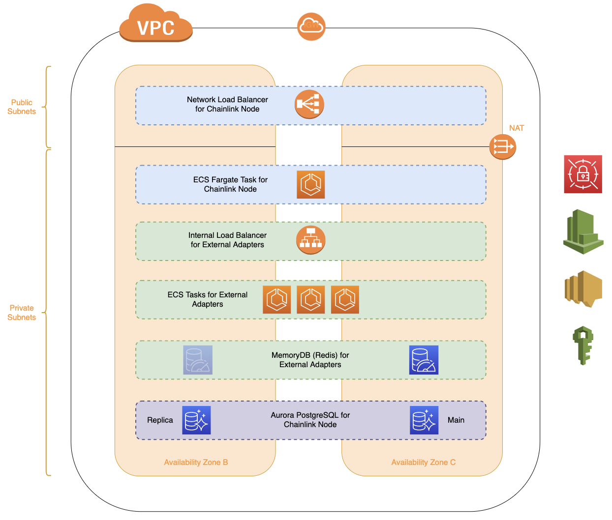

# Chainlink Node Terraform Module

Terraform module which creates AWS serverless infra for Chainlink Node:
  - AWS Fargate
  - AWS Network Load Balancer
  - AWS IAM
  - AWS CloudWatch

Terraform module for Chainlink External Adapters: [here](https://github.com/orionterra/terraform-aws-chainlink-ea)

## Architecture overview



Where:

-  Covered by this Chainlink Node terraform [module](https://github.com/orionterra/terraform-aws-chainlink-node)
-  Covered by Chainlink External Adapters terraform [module](https://github.com/orionterra/terraform-aws-chainlink-ea)
-  Covered by RDS community terraform [module](https://github.com/terraform-aws-modules/terraform-aws-rds-aurora)
-  Covered by VPC community terraform [module](https://github.com/terraform-aws-modules/terraform-aws-vpc)

## Usage

### Basic example

Full example [here](https://github.com/orionterra/terraform-aws-chainlink-node/tree/main/examples/complete_example)

```hcl
module "chainlink_node" {
  source  = "ChainOrion/chainlink-node/aws"

  project     = local.project
  environment = local.environment

  aws_region     = "eu-west-1"
  aws_account_id = data.aws_caller_identity.current.account_id

  vpc_id              = module.vpc.vpc_id
  vpc_cidr_block      = module.vpc.vpc_cidr_block
  vpc_private_subnets = module.vpc.private_subnets

  keystore_password_secret_arn = aws_secretsmanager_secret.keystore.arn
  api_credentials_secret_arn   = aws_secretsmanager_secret.api.arn
  database_url_secret_arn      = aws_secretsmanager_secret.db.arn

  # Always check latest versions
  node_version        = "1.10.0"
  task_cpu            = 1024
  task_memory         = 2048
  chainlink_node_port = 14666
  chainlink_ui_port   = 6688
  subnet_mapping      = {
    (module.vpc.azs[0]) = {
      ip            = aws_eip.chainlink_p2p[module.vpc.azs[0]].public_ip
      subnet_id     = module.vpc.public_subnets[0]
      allocation_id = aws_eip.chainlink_p2p[module.vpc.azs[0]].id
    }
    (module.vpc.azs[1]) = {
      ip            = aws_eip.chainlink_p2p[module.vpc.azs[1]].public_ip
      subnet_id     = module.vpc.public_subnets[1]
      allocation_id = aws_eip.chainlink_p2p[module.vpc.azs[1]].id
    }
  }

  node_config = {
    OOT                                 = "/chainlink"
    LOG_LEVEL                           = "info"
    ETH_CHAIN_ID                        = "4"
    MIN_OUTGOING_CONFIRMATIONS          = "2"
    MINIMUM_CONTRACT_PAYMENT_LINK_JUELS = "1000000"
    LINK_CONTRACT_ADDRESS               = "0x01BE23585060835E02B77ef475b0Cc51aA1e0709"
    ALLOW_ORIGINS                       = "*"
    CHAINLINK_TLS_PORT                  = "0"
    SECURE_COOKIES                      = "false"
    FEATURE_OFFCHAIN_REPORTING          = "true"
    OCR_KEY_BUNDLE_ID                   = "61ab53fcf1fb783715a750920353522b2c8cb1494334bdc166945952baa598d9"
    P2P_PEER_ID                         = "p2p_12D3KooWMqVVtFhRxVfDHnXBzHviPiPVo3MTQq5TwvbPoxsoxmFJ"
    OCR_TRANSMITTER_ADDRESS             = "0xc11eDFd7Dd359492A686C2f27F66156CBb155D92"
    P2P_BOOTSTRAP_PEERS                 = "/dns4/rinkeby-bootstrap.dextrac.com/tcp/1100/p2p/12D3KooWFto8Fx141Kixn2JbfGXJWpt8U1B55oBQtsNZWRmyiq1D"
    DATABASE_LOCKING_MODE               = "lease"
  }
}
```

## Notes

### UI Access

Chainlink user interface port (6688 by default) is open only to the VPC CIDR block cause TLS support ins't supported yet by current module. In order to access the UI it's required to open a SSH tunnel to any available host/bastion in the VPC.

Example: `ssh -i $KEY ${USER}@${VPC_HOST_PUBLIC_IP} -L 6688:${NLB_ENDPOINT}:6688 -N`

### Secrets

Module is required the following AWS Secrets Manager secrets created and set:

- Secret that contain Keystore password (base64)
- Secret that contain API credentials (base64)
- Secret that contain value for DATABASE_URL environment variable (base64)
- Secret that contain TLS_CERT (base64) (optional, based on `tls_ui_enabled` and `tls_type` terraform variables)
- Secret that contain TLS_KEY (base64) (oprional, based on `tls_ui_enabled` and `tls_type` terraform variables)

Deploy order:

- Firstly, it's required to create and set AWS Secrets Manager objects ([example](https://github.com/orionterra/terraform-aws-chainlink-node/tree/main/examples/complete_example))
- Then, AWS ARN values of the created secrets should be specified in the module. ([example](https://github.com/orionterra/terraform-aws-chainlink-node/tree/main/examples/complete_example))

Name of the secret object isn't very important, but it's always good to follow good practice in naming convention.

Check example [here](https://github.com/orionterra/terraform-aws-chainlink-node/tree/main/examples/complete_example).

### Chainlink Node configuration parameters

It's possible to specify any environment variable from https://docs.chain.link/docs/configuration-variables/ using `node_config` terraform module variable except specified below:

- P2P_ANNOUNCE_IP (during Fargate container startup, init script will set this variable based on `subnet_mapping` terraform module variable)
- P2P_ANNOUNCE_PORT (this variable will be set from `chainlink_node_port` terraform module variable)
- P2P_LISTEN_IP (this variable will be set from `chainlink_listen_ip` terraform module variable)
- P2P_LISTEN_PORT (during Fargate container startup, init script will set this variable based on `chainlink_node_port` terraform module variable)
- P2P_NETWORKING_STACK (this variable will be set from `chainlink_p2p_networking_stack` terraform module variable)
- P2PV2_ANNOUNCE_ADDRESSES (during Fargate container startup, init script will set this variable based on `subnet_mapping` and `chainlink_node_port` terraform module variables)
- P2PV2_LISTEN_ADDRESSES (during Fargate container startup, init script will set this variable based on `chainlink_listen_ip` and `chainlink_node_port` terraform module variables)
- CLIENT_NODE_URL (this variable will be set from `chainlink_ui_port` terraform module variable)
- DATABASE_URL (this variable will be set from AWS Secrets Manager object using `database_url_secret_arn` terraform module variable)
- JSON_CONSOLE (this variable will be set to `true` in order to have an ability to use AWS CloudWatch metrics filter)
- TLS_CERT_PATH (during Fargate container startup, init script will set this variable based on `tls_ui_enabled` and `tls_type` terraform variables)
- TLS_KEY_PATH (during Fargate container startup, init script will set this variable based on `tls_ui_enabled` and `tls_type` terraform variables)
- SECURE_COOKIES (during Fargate container startup, init script will set this variable based on `tls_ui_enabled` and `tls_type` terraform variables)
- CHAINLINK_TLS_PORT (during Fargate container startup, init script will set this variable based on `tls_ui_enabled`, `tls_type`, and `tls_chainlink_ui_port` terraform variables)

Check example [here](https://github.com/orionterra/terraform-aws-chainlink-node/tree/main/examples/complete_example).

### Failover

Chainlink Node failover is realized using `subnet_mapping` terraform module variable and AWS Network Load Balancer. `P2P_ANNOUNCE_IP` environment variable is defined based on the AWS availability zone in which node container are running. In case of one of AWS availability zone failure, Fargate will drain node container in one az and run a new one in another based on NLB target group health checks.

Check example with properly set `subnet_mapping` terraform module variable [here](https://github.com/orionterra/terraform-aws-chainlink-node/tree/main/examples/complete_example).

### TLS Support

ATM, module supports imported TLS as described [here](https://docs.chain.link/chainlink-nodes/enabling-https-connections). AWS ACM ('acm') isn't supported yet.

Check example with imported TLS configuration [here](https://github.com/orionterra/terraform-aws-chainlink-node/tree/main/examples/imported_tls_example)

### Notifications

It's possible to specify your own AWS SNS topic for notifications. Otherwise, module will create SNS topic for notifications. Then you should manually add subscriptions to that topic.

## Examples

Create AWS Secrets Manager objects first by commenting out the section with module. Then set secret values and uncomment module section in the example.

- [Complete example](./examples/complete_example/main.tf)

<!-- BEGIN_TF_DOCS -->
## Requirements

| Name | Version |
|------|---------|
| <a name="requirement_terraform"></a> [terraform](#requirement\_terraform) | >= 1.0.0 |
| <a name="requirement_aws"></a> [aws](#requirement\_aws) | >= 4.12.0 |
| <a name="requirement_random"></a> [random](#requirement\_random) | 3.4.3 |

## Providers

| Name | Version |
|------|---------|
| <a name="provider_aws"></a> [aws](#provider\_aws) | >= 4.12.0 |
| <a name="provider_random"></a> [random](#provider\_random) | 3.4.3 |

## Modules

No modules.

## Resources

| Name | Type |
|------|------|
| [aws_cloudwatch_dashboard.this](https://registry.terraform.io/providers/hashicorp/aws/latest/docs/resources/cloudwatch_dashboard) | resource |
| [aws_cloudwatch_log_group.this](https://registry.terraform.io/providers/hashicorp/aws/latest/docs/resources/cloudwatch_log_group) | resource |
| [aws_cloudwatch_log_metric_filter.error_node_unreachable](https://registry.terraform.io/providers/hashicorp/aws/latest/docs/resources/cloudwatch_log_metric_filter) | resource |
| [aws_cloudwatch_metric_alarm.cpu_utilization](https://registry.terraform.io/providers/hashicorp/aws/latest/docs/resources/cloudwatch_metric_alarm) | resource |
| [aws_cloudwatch_metric_alarm.log_alarms](https://registry.terraform.io/providers/hashicorp/aws/latest/docs/resources/cloudwatch_metric_alarm) | resource |
| [aws_cloudwatch_metric_alarm.memory_utilization](https://registry.terraform.io/providers/hashicorp/aws/latest/docs/resources/cloudwatch_metric_alarm) | resource |
| [aws_ecs_cluster.this](https://registry.terraform.io/providers/hashicorp/aws/latest/docs/resources/ecs_cluster) | resource |
| [aws_ecs_service.this](https://registry.terraform.io/providers/hashicorp/aws/latest/docs/resources/ecs_service) | resource |
| [aws_ecs_task_definition.this](https://registry.terraform.io/providers/hashicorp/aws/latest/docs/resources/ecs_task_definition) | resource |
| [aws_iam_policy.this](https://registry.terraform.io/providers/hashicorp/aws/latest/docs/resources/iam_policy) | resource |
| [aws_iam_role.this](https://registry.terraform.io/providers/hashicorp/aws/latest/docs/resources/iam_role) | resource |
| [aws_iam_role_policy_attachment.this](https://registry.terraform.io/providers/hashicorp/aws/latest/docs/resources/iam_role_policy_attachment) | resource |
| [aws_lb.this](https://registry.terraform.io/providers/hashicorp/aws/latest/docs/resources/lb) | resource |
| [aws_lb_listener.node](https://registry.terraform.io/providers/hashicorp/aws/latest/docs/resources/lb_listener) | resource |
| [aws_lb_listener.node_v2](https://registry.terraform.io/providers/hashicorp/aws/latest/docs/resources/lb_listener) | resource |
| [aws_lb_listener.ui](https://registry.terraform.io/providers/hashicorp/aws/latest/docs/resources/lb_listener) | resource |
| [aws_lb_target_group.node](https://registry.terraform.io/providers/hashicorp/aws/latest/docs/resources/lb_target_group) | resource |
| [aws_lb_target_group.node_v2](https://registry.terraform.io/providers/hashicorp/aws/latest/docs/resources/lb_target_group) | resource |
| [aws_lb_target_group.ui](https://registry.terraform.io/providers/hashicorp/aws/latest/docs/resources/lb_target_group) | resource |
| [aws_security_group.this](https://registry.terraform.io/providers/hashicorp/aws/latest/docs/resources/security_group) | resource |
| [aws_security_group_rule.egress_allow_all](https://registry.terraform.io/providers/hashicorp/aws/latest/docs/resources/security_group_rule) | resource |
| [aws_security_group_rule.ingress_allow_node](https://registry.terraform.io/providers/hashicorp/aws/latest/docs/resources/security_group_rule) | resource |
| [aws_security_group_rule.ingress_allow_node_v2](https://registry.terraform.io/providers/hashicorp/aws/latest/docs/resources/security_group_rule) | resource |
| [aws_security_group_rule.ingress_allow_ui](https://registry.terraform.io/providers/hashicorp/aws/latest/docs/resources/security_group_rule) | resource |
| [aws_sns_topic.this](https://registry.terraform.io/providers/hashicorp/aws/latest/docs/resources/sns_topic) | resource |
| [random_string.alb_prefix_node](https://registry.terraform.io/providers/hashicorp/random/3.4.3/docs/resources/string) | resource |
| [random_string.alb_prefix_node_v2](https://registry.terraform.io/providers/hashicorp/random/3.4.3/docs/resources/string) | resource |
| [random_string.alb_prefix_ui](https://registry.terraform.io/providers/hashicorp/random/3.4.3/docs/resources/string) | resource |
| [aws_iam_policy_document.this](https://registry.terraform.io/providers/hashicorp/aws/latest/docs/data-sources/iam_policy_document) | data source |

## Inputs

| Name | Description | Type | Default | Required |
|------|-------------|------|---------|:--------:|
| <a name="input_api_credentials_secret_arn"></a> [api\_credentials\_secret\_arn](#input\_api\_credentials\_secret\_arn) | ARN of the Secrets Manager Secret in the same AWS account and Region that contains the API credentials for the chainlink node. Value of AWS SM object must be base64 encoded | `string` | n/a | yes |
| <a name="input_aws_account_id"></a> [aws\_account\_id](#input\_aws\_account\_id) | AWS account id. Used to add alarms to dashboard | `string` | n/a | yes |
| <a name="input_aws_region"></a> [aws\_region](#input\_aws\_region) | AWS Region (required for CloudWatch logs configuration) | `string` | n/a | yes |
| <a name="input_chainlink_listen_ip"></a> [chainlink\_listen\_ip](#input\_chainlink\_listen\_ip) | P2P\_LISTEN\_IP from chainlink OCR node config. Will be used in both V1 and V2 networking stack if enabled. More info here: https://docs.chain.link/chainlink-nodes/configuration-variables/#networking-stack-v1 | `string` | `"0.0.0.0"` | no |
| <a name="input_chainlink_node_port_p2pv1"></a> [chainlink\_node\_port\_p2pv1](#input\_chainlink\_node\_port\_p2pv1) | P2P\_ANNOUNCE\_PORT from the chainlink OCR node config. Required if chainlink\_p2p\_networking\_stack set to `V1` or `V1V2`. More info here: https://docs.chain.link/docs/configuration-variables/#networking-stack-v1 | `number` | `null` | no |
| <a name="input_chainlink_node_port_p2pv2"></a> [chainlink\_node\_port\_p2pv2](#input\_chainlink\_node\_port\_p2pv2) | Port that will be used in P2PV2\_ANNOUNCE\_ADDRESSES and P2PV2\_LISTEN\_ADDRESSES env variables from chainlink OCR node config. Required if chainlink\_p2p\_networking\_stack set to `V1V2` or `V2`. More info here: https://docs.chain.link/chainlink-nodes/configuration-variables/#networking-stack-v2 | `number` | `null` | no |
| <a name="input_chainlink_p2p_networking_stack"></a> [chainlink\_p2p\_networking\_stack](#input\_chainlink\_p2p\_networking\_stack) | P2P\_NETWORKING\_STACK from the chainlink OCR node config. More info here: https://docs.chain.link/chainlink-nodes/configuration-variables/#p2p_networking_stack | `string` | n/a | yes |
| <a name="input_chainlink_ui_port"></a> [chainlink\_ui\_port](#input\_chainlink\_ui\_port) | CHAINLINK\_PORT from the chainlink OCR node config. More info here: https://docs.chain.link/docs/configuration-variables/#chainlink_port | `number` | `6688` | no |
| <a name="input_database_url_secret_arn"></a> [database\_url\_secret\_arn](#input\_database\_url\_secret\_arn) | ARN of the Secrets Manager Secret in the same AWS account and Region that contains the database URL for the chainlink node. Value of AWS SM object must be base64 encoded | `string` | n/a | yes |
| <a name="input_environment"></a> [environment](#input\_environment) | Environment name | `string` | `"nonprod"` | no |
| <a name="input_keystore_password_secret_arn"></a> [keystore\_password\_secret\_arn](#input\_keystore\_password\_secret\_arn) | ARN of the Secrets Manager Secret in the same AWS account and Region that contains the keystore password for the chainlink node. Value of AWS SM object must be base64 encoded | `string` | n/a | yes |
| <a name="input_monitoring_enabled"></a> [monitoring\_enabled](#input\_monitoring\_enabled) | Defines whether to create CloudWatch dashboard and custom metrics or not | `bool` | `true` | no |
| <a name="input_node_config"></a> [node\_config](#input\_node\_config) | Chainlink node configuration environment variables. The full list could be found here: https://docs.chain.link/docs/configuration-variables/ | `map(any)` | n/a | yes |
| <a name="input_node_image_source"></a> [node\_image\_source](#input\_node\_image\_source) | Chainlink node docker image source. This variable can be used to rewrite default image source. Used AWS registry by default. Set to `smartcontract/chainlink` to use dockerhub registry | `string` | `"public.ecr.aws/chainlink/chainlink"` | no |
| <a name="input_node_version"></a> [node\_version](#input\_node\_version) | Chainlink node version. The latest version could be found here: https://hub.docker.com/r/smartcontract/chainlink/tags | `string` | n/a | yes |
| <a name="input_project"></a> [project](#input\_project) | Project name | `string` | n/a | yes |
| <a name="input_sns_topic_arn"></a> [sns\_topic\_arn](#input\_sns\_topic\_arn) | SNS topic arn for alerts. If not specified, module will create an empty topic and provide topic arn in the output. Then it will be possible to specify required notification method for this topic | `string` | `""` | no |
| <a name="input_subnet_mapping"></a> [subnet\_mapping](#input\_subnet\_mapping) | A map of values required to enable failover between AZs. See an example in ./examples directory | `map(any)` | n/a | yes |
| <a name="input_task_cpu"></a> [task\_cpu](#input\_task\_cpu) | Allocated CPU for chainlink node container | `number` | `2048` | no |
| <a name="input_task_memory"></a> [task\_memory](#input\_task\_memory) | Allocated Memory for chainlink node container | `number` | `4096` | no |
| <a name="input_tls_cert_secret_arn"></a> [tls\_cert\_secret\_arn](#input\_tls\_cert\_secret\_arn) | ARN of the Secrets Manager Secret in the same AWS account and Region that contains the TLS certificate. Required when `tls_ui_enabled`=`true` and `tls_type`=`import`. Value of AWS SM object must be base64 encoded | `string` | `""` | no |
| <a name="input_tls_chainlink_ui_port"></a> [tls\_chainlink\_ui\_port](#input\_tls\_chainlink\_ui\_port) | CHAINLINK\_TLS\_PORT from the chainlink OCR node config. More info here: https://docs.chain.link/chainlink-nodes/configuration-variables#chainlink_tls_port | `number` | `6689` | no |
| <a name="input_tls_key_secret_arn"></a> [tls\_key\_secret\_arn](#input\_tls\_key\_secret\_arn) | ARN of the Secrets Manager Secret in the same AWS account and Region that contains the TLS key. Required when `tls_ui_enabled`=`true` and `tls_type`=`import`. Value of AWS SM object must be base64 encoded | `string` | `""` | no |
| <a name="input_tls_type"></a> [tls\_type](#input\_tls\_type) | Defines TLS configuration. Set to `import` to import any existing TLS cert and key. It could be self-signed and created by Let's Encrypt. See more info here: https://docs.chain.link/chainlink-nodes/enabling-https-connections. AWS ACM ('acm') isn't supported yet. | `string` | `"import"` | no |
| <a name="input_tls_ui_enabled"></a> [tls\_ui\_enabled](#input\_tls\_ui\_enabled) | Defines if TLS configuration to access Chainlink Node UI should be enabled | `bool` | `false` | no |
| <a name="input_vpc_cidr_block"></a> [vpc\_cidr\_block](#input\_vpc\_cidr\_block) | The CIDR block of the VPC | `string` | n/a | yes |
| <a name="input_vpc_id"></a> [vpc\_id](#input\_vpc\_id) | ID of the VPC where Chainlink EAs should be deployed | `string` | n/a | yes |
| <a name="input_vpc_private_subnets"></a> [vpc\_private\_subnets](#input\_vpc\_private\_subnets) | VPC private subnets where Chainlink Node should be deployed (at least 2) | `list(any)` | n/a | yes |

## Outputs

| Name | Description |
|------|-------------|
| <a name="output_nlb_endpoint"></a> [nlb\_endpoint](#output\_nlb\_endpoint) | NLB endpoint to accsess Chainlink Node UI. UI port is open only to the VPC CIDR block, in order to access the UI it's required to open SSH tunnel to any available host/bastion in the VPC. More info in Readme.md |
| <a name="output_nlb_security_group_id"></a> [nlb\_security\_group\_id](#output\_nlb\_security\_group\_id) | ID of security group attached to NLB. It's possible to use it to configure additional sg inbound rules |
| <a name="output_node_config"></a> [node\_config](#output\_node\_config) | Chainlink node configuration environment variables |
| <a name="output_subnet_mapping"></a> [subnet\_mapping](#output\_subnet\_mapping) | A map of values required to enable failover between AZs |
<!-- END_TF_DOCS -->

## License

MIT License. See [LICENSE](https://github.com/orionterra/terraform-aws-chainlink-node/tree/main/LICENSE) for full details.

## Docs update

More about [terraform-docs](https://terraform-docs.io/user-guide/introduction/).

```bash
terraform-docs .
```
